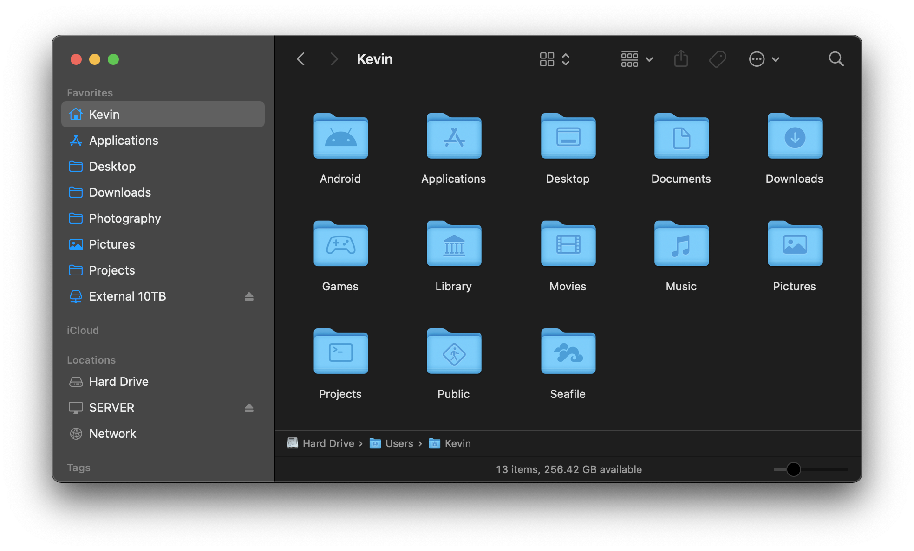

# macOS Folder Icons

This script generates custom folder icons using images (SVG, PNG, etc) or [SF Symbols](https://developer.apple.com/sf-symbols/). The blank folder icon is extracted from your system, you may need to change the path location and file name depending on your OS version. This script has only been tested on macOS Monterey 12.0.1.

## Getting Started

1. Download or clone the repo and open a terminal at the root of the project.
2. Place images in the [custom](custom) folder if you want to use SVGs or PNGs.
3. Copy symbols into the [symbols.txt](symbols.txt) file if you want to use [SF Symbols](https://developer.apple.com/sf-symbols/).
4. Run `./build.sh` to build the icons.
5. Icons are located in the [build](build) folder.

## Building on a different macOS version

1. Edit `ASSETS_LOCATION` to the appropriate path for your OS version.
2. Edit `DARK_FOLDER` and `LIGHT_FOLDER` to the appropriate file names of the extracted assets.

## Contributing

Pull requests are welcome. I don't write Shell scripts much, so there's probably plenty of areas for improvement. A few things I'd like to add:

- Automatically detect the OS version and set the correct asset path and folder file name.
- Error handling. If this script fails, and you'll probably have no idea why.
- Not including [acextract](https://github.com/bartoszj/acextract) in this repo.
- Use something other than ImageMagick, it's quite slow if you build a lot of icons at once.
- Building a web app so users can easily make icons from their browser.
